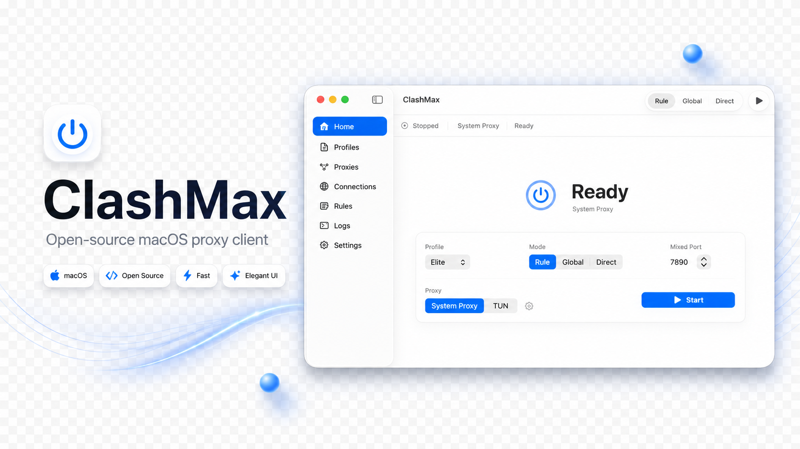

<p align="center">
  
</p>

<div align="center">
  <h1>ClashMax</h1>
  <p><strong>English</strong> | <a href="README.zh-CN.md">简体中文</a></p>
  <p>A native Mihomo proxy client for macOS, focused on profile management, runtime control, proxy groups, connections, rules, logs, and system integration.</p>
  <p>
    
    
    
    
  </p>
</div>

## Overview

ClashMax is a native macOS graphical Mihomo client built with SwiftUI. It is not a cross-platform shell. It is a proxy control console designed around macOS workflows: import profiles, start the core, switch proxy groups, inspect connections and rules, follow logs, and move quickly between system proxy mode and TUN mode.

The interface stays restrained, compact, and easy to scan. The first screen is the actual proxy console, with common status and actions presented directly instead of being blocked by a marketing page or lengthy onboarding.

## How To Use ClashMax

1. Open the [latest GitHub Release](https://github.com/marvinli001/ClashMax/releases/latest) and download the `ClashMax-X.Y.Z.zip` asset for the current release.
2. Unzip the archive to get `ClashMax.app`.
3. Move `ClashMax.app` into the system `/Applications` folder. This is required for the normal installed-app workflow and for macOS system integration paths such as helper approval and the experimental Network Extension.
4. Launch ClashMax from `/Applications`, import a Clash/Mihomo YAML profile or add a subscription, then start the runtime from the Dashboard.
5. If macOS asks for permissions, approve the requested helper or System Extension prompts. TUN mode and `NE Proxy` need the corresponding macOS approval before they can run.

## Core Capabilities

- Native macOS app experience covering Dashboard, Profiles, Proxies, Connections, Rules, Logs, Settings, and menu bar controls.
- Import local Clash/Mihomo YAML profiles, plus add, update, rename, and delete subscription profiles.
- Preserve original YAML files unchanged and generate a ClashMax-managed runtime YAML before launch, so ports, controller, secret, DNS, TUN, and runtime mode can be injected safely.
- Bundle Mihomo as a sidecar core and show the app version, build number, and bundled Mihomo version in Settings.
- Support standard system proxy mode, where the user-mode core owns HTTP, HTTPS, and SOCKS proxy configuration and restoration.
- Support the privileged helper-backed TUN path, adapted to macOS system approval and permission models.
- Integrate with Mihomo REST and WebSocket control APIs for version, config, proxy groups, providers, rules, connections, traffic, and logs.
- Support proxy group switching, delay testing, provider health checks, mode switching, connection closing, runtime restart, and live log observation.
- Provide lightweight runtime controls in the menu bar for quick daily status checks, proxy switching, and update checks.

## Use Cases

- Daily proxy control: select a profile, start Mihomo, and switch between Rule, Global, Direct, and other runtime modes as needed.
- Node and proxy group management: inspect proxy group status, manually switch nodes, run delay tests, and trigger provider health checks.
- Connection troubleshooting: inspect active connections, destination addresses, rule matches, and traffic changes, then close specific connections when needed.
- Rules and log tracing: quickly review rule lists and runtime logs to diagnose profile or network issues.
- System integration: switch between standard system proxy and TUN mode, and restore system proxy state when the runtime stops.

## Requirements

- macOS 26+
- Apple Silicon or Intel Mac
- TUN mode requires approving helper permissions when prompted by macOS on first use

## Security And Privacy

- Imported YAML profiles remain unchanged and are stored locally.
- Subscription URLs are stored in Keychain by profile ID.
- Runtime configs are written to a ClashMax-managed Application Support path.
- The Mihomo controller listens on `127.0.0.1` by default.
- A new controller secret is generated for every launch, and Bearer authentication is used for control API access.
- TUN mode is handled by a privileged helper, and the helper validates app-owned core/config paths.
- MVP core policy is intentionally single-channel: only the app-owned bundled Mihomo core is supported. Future core channels must add a manifest, signature/hash verification, helper allowlisting, UI state, and rollback first.
- macOS TUN runtime config does not write Linux-only `auto-redirect`.

## Downloads And Updates

Release builds are distributed through GitHub Releases. After installation, ClashMax can check for app updates in-app. Each app release includes the matching stable Mihomo core, so users do not need to install or maintain a separate core binary.

## Community

- Use [Issues](https://github.com/marvinli001/ClashMax/issues) for reproducible bugs, actionable feedback, and implementation tasks that are specific enough to track.
- Use [Questions](https://github.com/marvinli001/ClashMax/discussions/new?category=questions) for installation, usage, setup, and runtime troubleshooting conversations.
- Use [Ideas](https://github.com/marvinli001/ClashMax/discussions/new?category=ideas) for early feature ideas, product direction, and workflow proposals before they become implementation tasks.
- Use [Development](https://github.com/marvinli001/ClashMax/discussions/new?category=development) before starting larger contributions that need design alignment, ownership boundaries, or release-sensitive verification.
- Before opening a report, remove subscription URLs, node credentials, private domains, and other sensitive profile data from screenshots or logs.

## Local Development

Project-level development rules live in [docs/DEVELOPMENT.md](docs/DEVELOPMENT.md). Keep local agent notes in `AGENTS.md`; that file is intentionally not committed.

The Xcode project is generated from `project.yml` with XcodeGen, and `ClashMax.xcodeproj/` is not committed. After cloning the repository, run:

```bash
xcodegen generate
```

Then open the generated `ClashMax.xcodeproj`, or run the test command directly:

```bash
xcodebuild test -project ClashMax.xcodeproj -scheme ClashMax -destination 'platform=macOS' -derivedDataPath DerivedData CODE_SIGNING_ALLOWED=NO
```

## License

ClashMax is released under the GPL-3.0 license. The project distributes and controls Mihomo, so it keeps an open-source licensing boundary compatible with the Mihomo ecosystem.

## Sponsorship

If ClashMax is useful to you, you can support the project through the GitHub Sponsor button. Sponsorship helps keep maintenance, release work, and macOS compatibility testing sustainable.

## Acknowledgements

- [Mihomo](https://github.com/MetaCubeX/mihomo) provides the proxy core.
- [Yams](https://github.com/jpsim/Yams) provides YAML parsing and generation.
- [Pow](https://github.com/EmergeTools/Pow) provides SwiftUI effects.
- [SwiftUI-Shimmer](https://github.com/markiv/SwiftUI-Shimmer) provides loading skeleton shimmer effects.
- [Sparkle](https://github.com/sparkle-project/Sparkle) provides the macOS app update framework.
