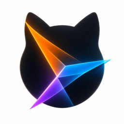

  
  <h1>ClashMax</h1>
  
面向 macOS 的原生 Mihomo 代理客户端，聚焦配置管理、运行控制、代理组、连接、规则、日志和系统集成。

  

    
    
    
    
  

## 简介

ClashMax 是一个使用 SwiftUI 构建的原生 macOS Mihomo 图形客户端。它不是跨平台外壳，而是围绕 macOS 工作流设计的代理控制台：导入配置、启动核心、切换代理组、查看连接和规则、跟踪日志，并在系统代理模式和 TUN 模式之间快速切换。

应用界面保持克制、紧凑、可扫描。第一屏就是实际代理控制台，常用状态和操作直接呈现，不通过营销页或冗长引导阻断使用。

## 核心能力

- 原生 macOS 应用体验，覆盖 Dashboard、Profiles、Proxies、Connections、Rules、Logs、Settings 和菜单栏控制。
- 支持导入本地 Clash/Mihomo YAML 配置，并支持订阅配置的添加、更新、重命名和删除。
- 保留原始 YAML 不变，启动前生成 ClashMax 托管的 runtime YAML，便于安全注入端口、controller、secret、DNS、TUN 和运行模式。
- 内置 Mihomo sidecar core，并在设置中呈现 App 版本、构建号和随包内置的 Mihomo 版本。
- 支持普通系统代理模式，由用户态核心负责 HTTP、HTTPS、SOCKS 代理设置与恢复。
- 支持 privileged helper 驱动的 TUN 路径，适配 macOS 的系统批准和权限模型。
- 接入 Mihomo REST 与 WebSocket 控制面，覆盖版本、配置、代理组、provider、规则、连接、流量和日志。
- 支持代理组切换、延迟测试、provider health check、模式切换、连接关闭、运行时重启和实时日志观察。
- 菜单栏提供轻量运行控制，适合日常快速查看状态、切换代理和检查更新。

## 使用场景

- 日常代理控制：选择配置，启动 Mihomo，按需切换 Rule、Global、Direct 等运行模式。
- 节点与代理组管理：查看代理组状态，手动切换节点，执行延迟测试和 provider health check。
- 连接排查：查看当前连接、目标地址、规则命中和流量变化，必要时关闭指定连接。
- 规则与日志追踪：快速检查规则列表和 runtime 日志，定位配置或网络异常。
- 系统集成：在普通系统代理和 TUN 模式之间切换，并在停止运行时恢复系统代理状态。

## 系统要求

- macOS 26+
- Apple Silicon 或 Intel Mac
- 首次使用 TUN 模式时，需要按系统提示批准 helper 权限

## 安全与隐私

- 导入的 YAML profile 保持原样并存储在本地。
- 订阅 URL 按 profile ID 存入 Keychain。
- runtime config 写入 ClashMax 托管的 Application Support 路径。
- Mihomo controller 默认只监听 `127.0.0.1`。
- 每次启动生成新的 controller secret，并使用 Bearer 认证访问控制面。
- TUN 模式由 privileged helper 负责，helper 校验 app-owned core/config paths。
- macOS TUN runtime config 不写入 Linux-only `auto-redirect`。

## 下载与更新

发布版通过 GitHub Releases 提供。安装后，ClashMax 可在应用内检查 App 更新；每个 App release 都包含对应的 stable Mihomo 内核，用户不需要单独安装或维护 core binary。

## 许可证

ClashMax 使用 GPL-3.0 许可证发布。项目分发并控制 Mihomo，因此保留与 Mihomo 生态兼容的开源授权边界。

## 致谢

- [Mihomo](https://github.com/MetaCubeX/mihomo) 提供代理核心。
- [Yams](https://github.com/jpsim/Yams) 提供 YAML 解析和生成。
- [Pow](https://github.com/EmergeTools/Pow) 提供 SwiftUI effects。
- [Sparkle](https://github.com/sparkle-project/Sparkle) 提供 macOS app 更新框架。
