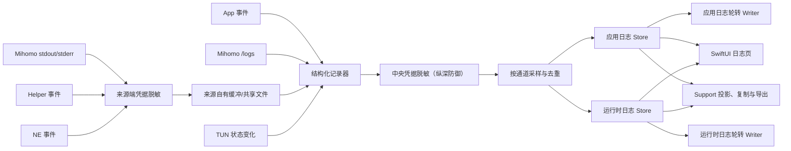

# ClashMax 结构化日志拆分设计

- 日期：2026-07-28
- 状态：已确认，等待实施计划
- 目标平台：macOS 15+
- 设计范围：主窗口侧边栏中的“日志”页面、状态页近期日志、应用日志与 Mihomo/Helper/NE/TUN 运行时日志链路

## 1. 背景

ClashMax 当前只有一份 `RuntimeDataStore.logs` 内存缓冲。`AppModel.appendAppLog` 产生的应用事件与 Mihomo `/logs` WebSocket 返回的运行时事件都写入这份缓冲；`LogEntry` 只有时间、级别和消息，没有通道、来源、类别或操作关联信息。主“日志”页面与状态页底部的近期日志卡片读取同一份混合数据。

这导致以下问题：

1. 应用事件与核心事件无法分辨，状态页所谓“运行时日志”实际包含应用日志。
2. 普通模式会隐藏所有 `debug`/`trace`，即使用户切换到 Debug 筛选也经常没有可提交的信息。
3. Helper、Network Extension 和 TUN 诊断分别保存在其他缓冲或快照中，未进入主日志页面。
4. Mihomo WebSocket 断线、重连和解码错误缺少可观察事件。
5. 用户模式 Mihomo 的 stdout/stderr 主要只在启动失败或崩溃时保留尾部。
6. `~/Library/Application Support/ClashMax/Logs` 已创建，但当前没有持续日志写入者。
7. 某一来源的日志风暴会挤掉另一来源的重要上下文，应用退出后日志也无法恢复。

## 2. 已确认的产品决策

### 2.1 采用完整结构化拆分

- 应用日志与运行时日志使用独立内存缓冲。
- 应用日志与运行时日志使用独立轮转文件。
- 运行时日志内部明确区分 Mihomo、Helper、NE 和 TUN。
- 普通模式默认显示经过脱敏和采样的 Support Debug。
- Developer Mode 在 Support 内容基础上增加 Developer/Trace 事件和结构化字段。
- 复制、导出、状态页和日志页使用同一套脱敏投影。

### 2.2 “内核级”范围

“内核级日志”仅指 Mihomo 核心以及 ClashMax 的 Helper、Network Extension 和 TUN 诊断，不采集 macOS 全系统 Unified Log、kernel log、Console archive 或 sysdiagnose。

### 2.3 界面范围

完整日志查看器位于主窗口侧边栏的“日志”页面，不嵌入 `MenuBarExtra` 的 312pt 紧凑面板。状态页和运行中首页复用的近期日志卡片只显示运行时 Support 日志，并可跳转到“运行时日志”Tab。

## 3. 目标

1. 真正隔离应用日志和运行时日志的容量、清空、恢复与轮转。
2. 为每个日志事件提供稳定、可测试的结构：来源、类别、事件编号、会话、操作和耗时。
3. 默认保留可直接提交给维护者的 Support Debug。
4. 增加 Mihomo、Helper、NE、TUN 的有效诊断信息，而不是单纯增加自然语言输出。
5. 支持重启后的有限历史恢复、实时滚动、搜索、筛选、复制和导出。
6. 任何凭据、私钥、订阅令牌或完整配置不得进入内存日志或日志文件。
7. 保持 SwiftUI 原生、状态驱动、可访问和高性能。
8. 不修改签名、Entitlements、Signing & Capabilities、App Group 或 Xcode 签名设置。

## 4. 非目标

- 不采集全系统 Unified Log、kernel log、sysdiagnose 或其他应用的日志。
- 不记录网络 payload、DNS 报文、完整配置 YAML 或完整路由表。
- 不增加遥测、远程上传、云端日志、自动提交 Issue 或账号系统。
- 不把完整日志查看器放入 macOS 菜单栏面板。
- 不引入第三方日志框架或新的持久化依赖。
- 不修改用户导入的原始 YAML；只允许 app-managed runtime YAML 使用新的默认日志级别。
- 不用 Developer Mode 绕过凭据脱敏。

## 5. 事件模型

新模型使用共同结构，但由两个独立通道存储：

```swift
struct StructuredLogEvent: Identifiable, Codable, Equatable, Sendable {
  var schemaVersion: Int
  var id: UUID
  var sequence: UInt64
  var timestamp: Date
  var receivedAt: Date
  var channel: LogChannel
  var source: LogSource
  var category: String
  var code: String
  var level: StructuredLogLevel
  var audience: LogAudience
  var message: String
  var metadata: [String: String]
  var sessionID: UUID
  var operationID: UUID?
  var repetitionCount: Int
}
```

### 5.1 通道

- `application`：ClashMax 应用生命周期、配置、控制器调用、设置应用、用户操作和错误。
- `runtime`：Mihomo、Helper、Network Extension、TUN。

### 5.2 来源

- `clashMax`
- `mihomo`
- `helper`
- `networkExtension`
- `tun`

应用通道只接受 `clashMax`。运行时通道不得接受 `clashMax`，避免再次出现混流。

### 5.3 级别

- `trace`
- `debug`
- `info`
- `warning`
- `error`
- `critical`

所有旧字符串级别在入口处规范化，未知值保留原始值到 metadata 并映射为最接近的安全级别。

UI 使用五个筛选项，而不是把六个底层级别逐项平铺：

- `All`：全部级别。
- `Debug`：`trace` + `debug`；普通模式仍只包含 Support 事件，Developer Mode 才增加 Developer/Trace。
- `Info`：`info`。
- `Warn`：`warning`。
- `Error`：`error` + `critical`。

`critical` 必须保留自己的底层级别、图标和视觉强调，只在筛选语义上归入 Error。

### 5.4 可见层级

- `support`：普通模式与 Developer Mode 均可见。
- `developer`：只在 Developer Mode 可见。

级别与可见层级相互独立。`debug + support` 是正常、默认可见的组合；普通模式不再按照级别一刀切隐藏全部 Debug。

### 5.5 时间和顺序

- Mihomo 结构化日志使用核心提供的 `time` 作为 `timestamp`。
- 其他来源使用事件实际发生时间。
- `receivedAt` 表示主 App 收到事件的时间，便于识别传输延迟。
- 每个通道在单次 App `sessionID` 内拥有从零开始的独立单调 `sequence`。
- 重启恢复后不延续旧会话的 `sequence`，也不尝试建立跨会话全局序号。
- UI 和恢复合并先按 `receivedAt` 排序，再以 `sessionID + sequence` 作为稳定 tie-breaker；跨通道不承诺全局顺序。

## 6. 独立日志通道

### 6.1 内存 Store

使用一个可复用的 `@MainActor @Observable LogChannelStore` 类型创建两个独立实例：

- `ApplicationLogStore` 配置：容量 2,000 条。
- `RuntimeLogStore` 配置：容量 5,000 条。

每个实例分别拥有：

- 自己的 `BoundedBuffer`。
- 自己的 250ms 合并发布任务。
- 自己的 generation、pending batch 和 overflow 计数。
- 自己的加载、写盘和错误状态。
- 独立的 `clear()`，不得修改另一通道。

`RuntimeDataStore` 不再拥有日志；现有 `logs`、`appendLog` 和可见性逻辑在迁移完成后移除。实施期间可以使用短期兼容适配器，但最终 UI 与诊断报告必须直接读取新 Store。

### 6.2 持久化 Writer

每个通道拥有独立的 `actor` writer，按 JSONL 写入现有私有 `Logs` 目录：

- `application.current.jsonl` 及轮转文件。
- `runtime.current.jsonl` 及轮转文件。

默认策略：

- 单个文件最大 4 MiB。
- 每个通道最多 5 个文件。
- 清理超过 7 天的记录。
- 两个通道总磁盘上限约 40 MiB。
- 目录权限 `0700`，文件权限 `0600`。

文件路径只允许由 `RuntimePaths.logs` 和固定文件名派生，不接受 App、Profile、Helper 或 API 提供的路径。轮转使用同目录原子替换；读取前拒绝符号链接和非普通文件。

每行包含 `schemaVersion`。读取器必须：

- 跳过无法解码的单行。
- 保留其余有效事件。
- 产生一次非递归的 Support 警告。
- 忽略未来 schema 中未知的可选字段。

启动时异步读取最近文件，与启动后新产生的事件按 `id` 去重合并，不得用历史快照覆盖实时事件。

历史恢复采用**有界尾部恢复**，不实现磁盘分页：

- 应用通道只恢复按 `receivedAt` 计算最新的 2,000 条有效事件。
- 运行时通道只恢复按 `receivedAt` 计算最新的 5,000 条有效事件。
- 读取器按文件时间从旧到新流式解码，并使用对应通道的有界缓冲只保留最新尾部，不把全部 JSONL 同时加载到内存。
- 恢复结果与当前会话实时事件按 `id` 去重，再按 `receivedAt`、`sessionID`、`sequence` 稳定合并并裁剪到通道容量。
- 当前会话的实时事件不得因恢复完成较晚而被历史快照覆盖。
- 超出内存尾部的旧记录只能通过“打开日志文件夹”查看；本期 UI 不提供磁盘历史分页。

## 7. 日志处理管线



任何来源在中央记录器之前拥有自己的内存环、输出 tail 或共享文件时，必须先执行来源端凭据脱敏。中央记录器的脱敏是纵深防御，不能被当作允许 Helper、NE、Core output drain 或命令错误先保存原始 secret 的理由。

中央处理顺序固定为：

1. 验证通道与来源组合。
2. 规范化级别、类别和事件编号。
3. 执行凭据级入口脱敏。
4. 分配会话、操作和通道序号。
5. 执行该通道的采样、重复合并与容量控制。
6. 追加到独立内存 Store。
7. 按顺序提交给该通道的 writer。

写盘失败不得再次进入正常写盘管线。日志系统自身错误进入容量很小的内存应急缓冲，并在 UI 显示一次明确警告。

## 8. 隐私与脱敏

### 8.1 凭据级入口脱敏

任何事件进入**任意生产者自有缓冲、共享文件、主 App 内存或轮转文件前**，必须删除或替换：

- `Authorization`、Bearer secret、Cookie 和自定义认证 Header。
- URL userinfo、订阅 query token 和可识别的 path token。
- Proxy URI 密码、代理 UUID、private key、PSK、client secret。
- Profile 原始 YAML、完整 runtime YAML 和 Provider 原始内容。
- 用户主目录和包含 Profile UUID 的完整运行时路径。
- 命令参数中携带的 secret。

现有 TUN 检查把 Bearer 放入命令参数。扩大日志前必须先把“真实执行参数”和“可显示命令描述”分开；错误消息不得拼回真实参数。

凭据级规则必须实现为可在 App、Helper 和 Network Extension target 中复用的 Shared 纯函数：

- Helper 在把 stdout/stderr 行写入自己的环形缓冲前调用。
- NE 在把事件写入 App Group diagnostics JSON 前调用。
- 用户模式 Mihomo `LiveOutputDrain` 在把完整行写入 output tail 前调用；不得先保留原始 chunk。
- TUN/命令执行器在构造可显示错误前调用。
- 主 App 中央记录器对所有来源再次调用，作为纵深防御。

跨 chunk 的 stdout/stderr 必须先做有界逐行组装；只有完成脱敏的行可以进入 tail。超过最大行长的内容先截断并记录截断计数，不能为了等待换行无限保留未脱敏数据。

### 8.2 Support 投影

普通模式、复制、导出和诊断报告使用 Support 投影，额外处理：

- 完整公网/局域网 IP。
- 完整域名、节点名、Profile 名和应用访问目标。
- 来源应用标识中不需要提交的用户信息。
- 可能关联用户身份的路径、接口详情和网络元数据。

Support 投影保留错误域、错误码、端口类别、阶段、耗时、计数和同一会话内可关联的短哈希。

### 8.3 Developer 投影

Developer Mode 可以显示入口脱敏后的域名/IP、内部阶段、结构化字段和 Developer/Trace 事件，但仍不能显示任何凭据、私钥、订阅令牌、用户目录或完整 YAML。

本地 JSONL 可以保存入口脱敏后的 Developer 事件，依靠 `0600` 文件权限保护。它不是“可直接提交”的格式；所有 UI 复制和导出动作仍强制使用 Support 投影。

脱敏必须幂等，同一事件多次经过 Support 投影不会继续破坏无关内容。

## 9. 采样、重复合并与诊断质量

以下事件永不采样：

- Warning、Error、Critical。
- 启动、停止、崩溃和状态转换。
- 修复动作及结果。
- 流连接、断开、重连最终失败。
- 缓冲溢出和持久化失败。

高频 Debug/Trace 按 `source + code + category + support fingerprint` 在短窗口内合并。合并后的事件更新 `repetitionCount`，例如“1 秒内重复 84 次”。

每个通道维护并显示：

- 被合并的事件数。
- 因容量丢弃的事件数。
- 因采样丢弃的事件数。
- 解码失败数。
- 最后成功事件时间。
- writer 最近错误。

NE 不逐连接长期记录；Mihomo 的 DNS、Rule 和连接级 Debug 允许在 Developer 视图中出现，但 Support 投影应优先产生类别、计数和短哈希，避免形成访问历史。

## 10. 来源集成

### 10.1 ClashMax 应用事件

应用日志至少覆盖：

- App 启动、终止和 warmup 决策。
- Runtime 启动、停止、重启与触发原因。
- 配置生成、验证、重载阶段和耗时。
- Controller 请求类别、状态码、错误域和错误码。
- 流连接、断开、重连次数和最终结果。
- Helper/NE/TUN 协调动作。
- 任务取消、超时和被旧 generation 拒绝的结果。

自然语言 message 用于展示；`code`、`category`、metadata 才是稳定测试和定位依据。

### 10.2 Mihomo

官方 Mihomo 文档说明：

- `log-level: debug` 才会产生尽可能完整的运行时信息。
- `/logs` 支持 `level=debug`。
- `/logs` 支持 `format=structured`，返回 `time`、`level`、`message` 和 `fields`。

参考：

- <https://wiki.metacubex.one/en/config/general/>
- <https://wiki.metacubex.one/en/api/>

因此：

- 新安装及缺少旧持久化值时，app-managed runtime 默认 `log-level` 为 `debug`。
- 已存在且由用户明确保存的 `info`/`warning`/`error` 设置继续尊重。
- Developer Mode 只改变可见性，不偷偷修改用户的 runtime log level。
- 当有效级别低于 Debug 时，日志页明确提示“Mihomo Debug 受当前 Runtime Log Level 限制”。
- WebSocket 使用 `level=<effective level>&format=structured`。
- 解码结构化字段并保留 Mihomo 时间；兼容旧 payload 格式。
- stdout 与 stderr 分别标记类别，并与 `/logs` 使用事件指纹去重。
- 启动前、Controller 未就绪、崩溃和退出尾部始终保留。

### 10.3 Helper

Helper 环形缓冲改为带 ID、时间、级别、类别和事件编号的结构化事件。优先复用现有 `recentLogs` XPC 方法的传输边界，避免无必要新增特权接口：

- Helper 必须在写入自己的 200 条（或实施计划确定的新容量）环形缓冲前执行 Shared 凭据脱敏。
- 新 Helper 返回可解析的结构化记录。
- App 对旧 Helper 的纯文本逐行包装为 `helper.legacy-output`。
- TUN 运行时主 App 增量拉取、按事件 ID 去重。
- Helper 停止或 XPC 失败时立即尝试最后一次拉取。

至少记录：

- XPC 连接接受/拒绝的脱敏原因。
- 协议、构建和指纹协商结果。
- 路径与代码签名验证阶段，不记录完整路径或签名原文。
- 启动、PID、退出码、SIGTERM/SIGKILL 和耗时。

### 10.4 Network Extension

沿用现有 App Group 共享诊断文件，不新增 entitlement：

- NE 必须在事件进入内存事件环和 App Group JSON 前执行 Shared 凭据脱敏。
- 扩展快照中的有限事件环。
- 使用稳定事件 ID，主 App 每次只导入未见事件。
- 保留旧 schema 默认值，允许主 App 与旧 NE 组合启动。
- 记录 Provider 启停、VPN 状态、SOCKS 握手阶段、TCP/UDP/DNS 错误分类和计数。
- 不持久化 payload 或逐流数据。

### 10.5 TUN

将现有 `TunDiagnosticsSnapshot` 的检查结果做差异化记录：

- controller、Helper PID、utun、默认路由、排除路由和 DNS 检查。
- 只在状态、错误码或摘要变化时记录。
- 失败、恢复、用户触发刷新和修复动作始终记录。
- 命令退出码可以记录，完整命令行和 Bearer 参数不得记录。

## 11. SwiftUI 页面设计

### 11.1 状态所有权

- 两个日志 Store 使用 `@Observable` 和 `@Environment`。
- 页面 Tab、级别、来源、搜索、展开行和滚动状态使用本地 `@State`。
- 跨页面的“打开运行时日志”使用小型、独立的 `@Observable LogNavigationState`，不嵌套到另一个 `@Observable` 对象。
- 不为简单视图状态增加 ViewModel。

### 11.2 页面工具栏

`LogsView` 顶部使用原生控件：

- 两个主通道使用 segmented `Picker`。
- 五个级别筛选项使用菜单样式 `Picker`，避免超过 segmented control 的合理项目数；映射固定为 All、Debug（Trace + Debug）、Info、Warn、Error（Error + Critical）。
- 运行时五个来源使用菜单样式 `Picker`。
- 全文搜索使用 `.searchable`。
- 操作菜单包含复制当前结果、导出当前日志、打开日志文件夹和清空当前日志。

从侧边栏进入默认选择应用日志。状态页的“打开日志”设置 `LogNavigationState` 后进入运行时日志。

### 11.3 日志列表

使用 `ScrollView + LazyVStack`，因为日志行需要展开结构化详情、实时追加和精确的底部跟随：

- 每行显示毫秒时间、级别、来源、类别/事件编号和消息。
- 稳定事件 ID 驱动 SwiftUI diff 和滚动定位。
- 单击行展开 metadata、operation ID、重复次数和接收延迟。
- 级别同时使用文字、SF Symbol 和语义颜色，不只依赖颜色。
- 不为每条新日志执行插入动画。

macOS 15 使用 `ScrollPosition`、`ScrollViewReader` 和滚动几何变化检测：

- 用户位于底部时自动跟随。
- 用户向上查看历史后暂停跟随。
- 显示“跳到最新”和待查看数量。
- 点击后恢复跟随。
- 两个 Tab 分别保留筛选和滚动状态。

参考：

- <https://developer.apple.com/documentation/swiftui/lazyvstack>
- <https://developer.apple.com/documentation/swiftui/scrollposition>
- <https://developer.apple.com/documentation/swiftui/view/onscrollgeometrychange(for:of:action:)>

组合搜索和筛选使用纯 `Sendable` 查询模型，通过可取消的 `.task(id:)` 在主线程外处理；旧查询不得覆盖新结果。

### 11.4 状态与可访问性

- 磁盘历史恢复显示短暂、明确的加载状态。
- Runtime 正在连接且暂时无内容时可使用现有共享 SwiftUI-Shimmer。
- 停止、空、失败、安全警告和恢复操作不得使用骨架屏。
- 支持 VoiceOver、键盘焦点、`help`、字体缩放、窗口缩窄和中英文长文本。
- 新于 macOS 15 的 API 必须使用 `#available` 并提供 SwiftUI 原生回退，不提高部署目标。

### 11.5 操作

- “复制当前结果”：复制当前通道和筛选条件下的 Support 文本。
- “导出当前日志”：导出单个 UTF-8 文件，包含 App 版本、生成时间、时间范围、通道、筛选条件和 Support 事件。
- “打开日志文件夹”：保留现有功能；UI 明确原始 JSONL 为本地 Developer 记录，不是直接提交格式。
- “清空当前日志”：确认后只清除当前通道的内存、pending batch 和轮转文件；另一通道不受影响。
- “复制运行诊断”：分别包含应用日志尾部和运行时日志尾部，继续执行 Support 脱敏。

### 11.6 状态页近期日志

`RecentLogsRuntimeCard` 只读取运行时 Store：

- 最多显示最近 6 条 Support 事件。
- 显示 Mihomo、Helper、NE 或 TUN 来源。
- 点击卡片或“打开日志”进入运行时 Tab。
- 该组件当前也用于运行中首页；复用处保持相同运行时语义。

## 12. 错误处理

- 写盘失败：继续保留内存日志，显示一次非递归警告，并允许重试。
- 单行 JSONL 损坏：跳过该行，其他历史继续加载。
- Helper 不可达：运行时日志仍显示 Mihomo/NE/TUN，并记录 Helper 来源状态。
- NE 共享文件不可读：保留上次有效快照并记录权限或解码状态，不伪装成“没有错误”。
- Mihomo 日志流断开：记录错误域、错误码、断开时间、重连次数和恢复时间；不得吞掉原因。
- TUN 检查受权限限制：记录 `EPERM`/不可用，不把“无法读取”解释为“不存在”。
- 清空期间存在 pending publish/write：提升 generation，使迟到任务无法复活旧日志。
- App 终止：对两个通道分别做有界 flush；不得无限阻塞退出。

## 13. 迁移与兼容

- 原有日志只在内存中，不迁移历史内容。
- 新安装和缺少持久化 `logLevel` 的设置使用 `debug` 默认值。
- 已存在的显式 runtime log level 保持不变。
- 旧 Mihomo `/logs` payload 继续兼容。
- 旧 Helper 文本日志包装为 Legacy 结构化事件。
- 旧 NE diagnostics JSON 使用默认值解码。
- `RuntimeDiagnosticsReport` 兼容原有复制入口，但输出分开的 Application Logs 和 Runtime Logs。
- 原有 `LogLevelStyle` 的视觉语义保留并扩展为结构化级别。

## 14. 测试策略

所有行为使用测试驱动开发：先写单一行为的失败测试，确认因功能缺失而失败，再写最小实现。

### 14.1 模型与 Store

- 通道/来源合法性。
- 两个缓冲容量和溢出互不影响。
- `debug + support` 在普通模式可见。
- Developer 事件只在 Developer Mode 可见。
- 250ms 合并发布。
- 清空时 generation 阻止旧 pending 事件复活。
- 重复合并、采样计数和重要事件绕过采样。

### 14.2 文件与恢复

- 4 MiB/5 文件/7 天策略。
- 独立轮转互不影响。
- 权限 `0600`、拒绝符号链接和路径逃逸。
- 损坏单行恢复。
- 未来 schema 可选字段兼容。
- 启动历史与实时事件合并不丢失、不重复。

### 14.3 隐私

一个复合 sentinel 事件同时包含：

- Bearer secret。
- Subscription URL token。
- Authorization/Header 值。
- Proxy URI 密码和 UUID。
- Private key/PSK。
- 用户主目录。
- IP、域名、节点和 Profile 名。

断言：

- 凭据 sentinel 不会先进入 Helper 环形缓冲、NE App Group JSON、Mihomo output tail 或 TUN 可显示命令错误。
- 凭据 sentinel 不会出现在内存、JSONL、复制文本或导出文件。
- Developer 事件仍不含凭据。
- Support 投影进一步隐藏网络身份。
- 时间、级别、事件编号、错误域、错误码、阶段和耗时仍然可用。

### 14.4 来源集成

- App 事件只能进入应用通道。
- Mihomo structured payload 保留核心时间和字段。
- 旧 Mihomo payload 兼容。
- stdout/stderr 与 `/logs` 去重。
- 日志流断开、重连、旧 generation 和停止后的迟到事件。
- Helper 新格式、旧文本、增量去重和最后拉取。
- NE 新事件导入、旧 schema 和重复 ID。
- TUN 只记录变化、失败、恢复和修复。

### 14.5 SwiftUI 策略

将以下逻辑提取为纯策略测试：

- 默认 Tab 与状态页跳转目标。
- 通道、级别、来源和搜索组合。
- 用户位于底部时自动跟随。
- 上滚暂停、待查看计数和跳到最新。
- 状态页只显示运行时 Support 事件。
- 停止、空、失败和临时连接状态。
- Copy/Export 使用当前筛选且强制 Support 投影。

同时更新本地化和辅助功能相关测试。

### 14.6 验证顺序

1. 日志模型、脱敏和轮转存储窄测。
2. Mihomo、Helper、NE、TUN fake 集成测试。
3. 日志页、状态页、菜单面板回归和本地化测试。
4. 完整命令：

   ```sh
   xcodebuild test \
     -project ClashMax.xcodeproj \
     -scheme ClashMax \
     -destination 'platform=macOS' \
     -derivedDataPath DerivedData \
     CODE_SIGNING_ALLOWED=NO
   ```

报告使用 `PASS`、`FAIL`、`BLOCKED`、`NOT RUN`。

自动化测试不得启动真实 Mihomo、修改系统代理/DNS/路由或安装 Helper/NE。真实 Helper、NE、TUN 验收需要系统操作时必须等待用户明确执行。

## 15. 验收标准

1. 应用日志和运行时日志拥有独立内存容量、清空和轮转文件。
2. 日志风暴不会跨通道挤掉记录。
3. 普通模式默认显示安全、有效的 Support Debug。
4. Developer Mode 增加详细事件，但永不显示凭据或完整配置。
5. 运行时日志可准确筛选 Mihomo、Helper、NE 和 TUN。
6. Mihomo structured 日志保留核心时间，断线和重连原因可见。
7. Helper、NE、TUN 关键状态变化可形成历史。
8. 应用重启后可以恢复保留期内的历史。
9. 用户在底部时日志自动跟随，上滚后不会被抢回。
10. 复制、导出和运行诊断均通过 Support 投影，可直接提交。
11. 状态页只显示最近运行时 Support 日志并正确跳转。
12. 文件损坏、写盘失败或某来源不可用不会阻止其他日志工作。
13. 所有新 UI 符合 macOS 15+ 的 SwiftUI 原生状态管理、可访问性和性能规范。
14. 不修改 Signing、Entitlements、App Group 或 Xcode Signing & Capabilities。
15. Helper、NE、Mihomo output tail 和 TUN 命令错误在其来源自有缓冲或文件之前完成凭据脱敏。
16. 启动恢复最多载入应用 2,000 条、运行时 5,000 条最新尾部，不提供无界加载或磁盘分页。

## 16. 实施计划输入

实施计划应按依赖顺序拆分为可独立验证的阶段：

1. 隐私封堵与结构化事件模型。
2. 独立 Store、采样和文件轮转。
3. App 与 Mihomo 来源迁移。
4. Helper、NE、TUN 来源迁移。
5. SwiftUI 日志页与状态页。
6. Copy/Export/Diagnostics。
7. 窄测、完整测试和用户门控的真实系统验收。

每个阶段必须遵循测试先行，不允许先写生产实现再补测试。
